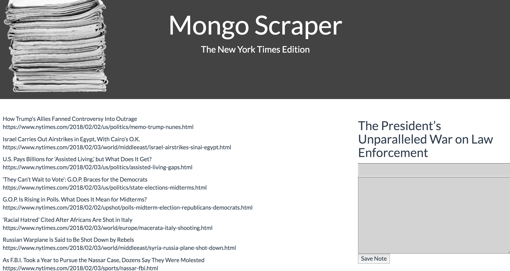

# mongoHeadlines

#Overview
An app that scrapes articles from the New York Times website and lets users save articles and leave comments on the latest news.

#How It Works
Scrape articles by going to by /scrape route.
Once articles are loaded, read full article by clicking the link in each article's panel.
Comments can be added on saved articles by clicking on the article.

#Technologies Used
Node.js
Express.js
MongoDB
Mongoose
npm packages
body-parser
express
mongoose
cheerio
axios